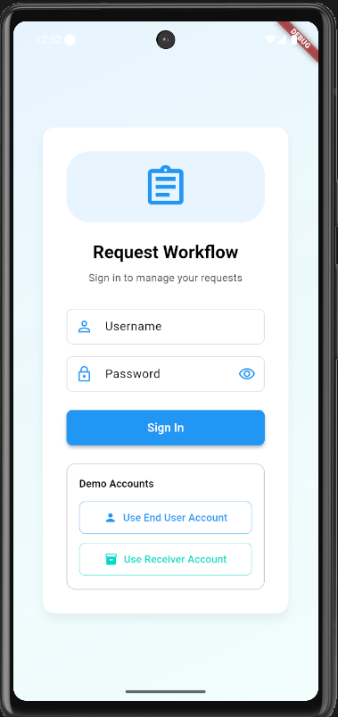
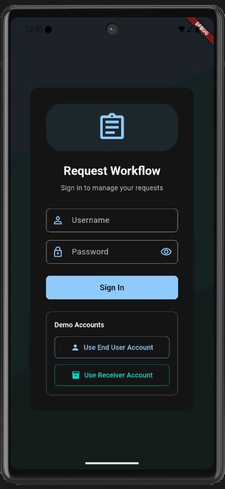
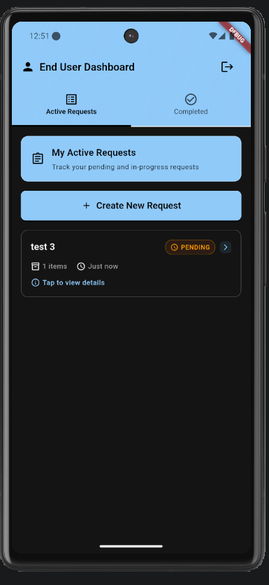
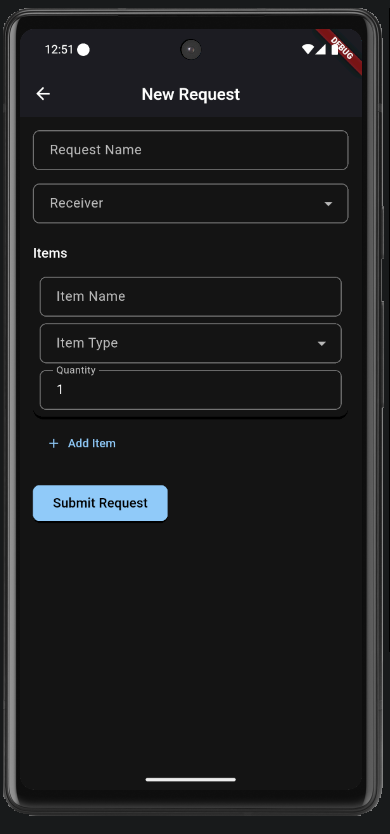
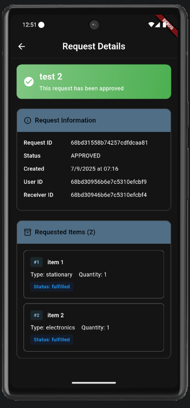
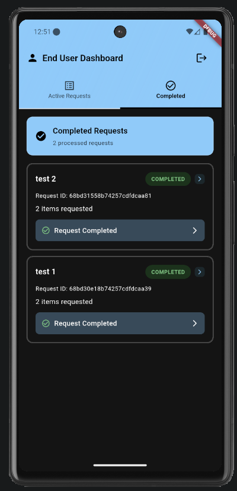
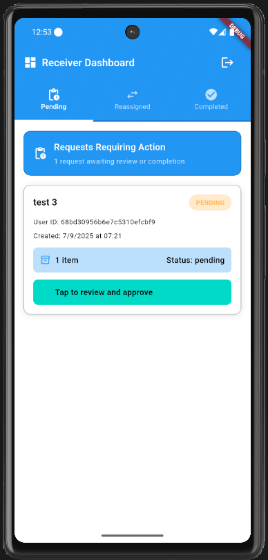
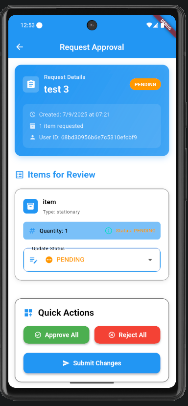

# 📱 Flutter Request Handling Workflow Application

## ADVAN DRIVE TECHNOLOGIES PRIVATE LIMITED FLUTTER INTERN TASK

#### VIEW DEMO VIDEO: [Demo Video Link](https://youtu.be/-hnkYIDN7lc)

A full-stack mobile application built with Flutter and Node.js that implements a real-world request and confirmation workflow system with dual-role functionality.

## 🏗️ System Architecture

### Frontend (Flutter)

- **Framework**: Flutter with Dart
- **State Management**: Riverpod for reactive state management
- **UI Framework**: Material Design 3 with adaptive theming
- **Real-time Communication**: WebSocket integration using Socket.io with fallback polling
- **Authentication**: JWT-based role authentication

### Backend (Node.js)

- **Runtime**: Node.js with Express.js
- **Database**: MongoDB for data persistence
- **Real-time**: WebSocket server using Socket.io for live updates
- **Authentication**: JWT tokens with bcrypt password hashing
- **API**: RESTful endpoints with proper error handling

## 🚀 Features Implemented

### ✅ End User Role

- **Request Creation**: Select multiple items with quantities and submit requests
- **Status Tracking**: Real-time view of request statuses (Pending, Confirmed, Partially Fulfilled)
- **Request History**: Complete history with detailed item breakdowns
- **Progress Monitoring**: Live updates when receivers process items

### ✅ Receiver Role

- **Request Review**: View all assigned pending requests with priority sorting
- **Item-by-Item Processing**: Individual item confirmation with status options:
  - Fulfilled
  - Reassigned (with reason and receiver selection)
  - Out of Stock
- **Reassignment System**: Transfer unconfirmed items to other receivers
- **Batch Operations**: Quick approve/reject all items functionality
- **Notes System**: Add reassignment reasons and processing notes

### ✅ Advanced Features

- **Real-time Updates**: WebSocket-powered live synchronization
- **Offline Support**: Graceful handling of network interruptions
- **Error Recovery**: Robust error handling with retry mechanisms
- **Responsive Design**: Adaptive UI for different screen sizes
- **Dark/Light Theme**: System-adaptive theming support

## 📱 App Screenshots

### Authentication & User Interface

| Login Screen (Light) | Login Screen (Dark) |
|:---:|:---:|
|  |  |

### End User Screens

| Active Requests | New Request Creation | Request Details | Completed Requests |
|:---:|:---:|:---:|:---:|
|  |  |  |  |

### Receiver Screens

| Pending Requests | Request Approval |
|:---:|:---:|
|  |  |

## 🔧 Technical Implementation

### State Management Architecture

```dart
// Riverpod Provider Pattern
final authProvider = StateNotifierProvider<AuthProvider, User>((ref) => AuthProvider());
final requestsProvider = StateNotifierProvider<RequestsProvider, List<Request>>((ref) => RequestsProvider());
```

### Real-time Communication

```dart
// WebSocket Integration
class SocketService {
  void connectToServer({required WidgetRef ref}) {
    // WebSocket connection with automatic reconnection
    // Queue-based message handling for reliability
    // Provider updates for real-time state synchronization
  }
}
```

### Authentication Flow

```dart
// JWT-based Authentication
class AuthProvider extends StateNotifier<User> {
  // Loading state management to prevent login flash
  // Secure token storage and validation
  // Role-based access control
}
```

## 🔗 API Endpoints

### Authentication

- `POST /auth/login` - User authentication
- `POST /auth/register` - User registration

### Requests Management

- `GET /api/request/all` - Fetch endUser/receiver requests
- `POST /api/request/add` - Create new request
- `POST /api/request/update` - Update request status

### Items

- `GET /api/item/types` - Fetch available items types

### Reassignments

- `GET /api/reassignment/all` - get all the reassignments for a receiver
- `POST /api/reassignment/accept/:id` - accept a reassignment
- `GET /api/reassignment/reject/:id` - reject a reassignment

### Others

- `GET /api/verifyToken` - verify JWT token validity
- `GET /api/receivers` - fetch all receivers

## 🛠️ Setup Instructions

### Prerequisites

- Flutter SDK (≥3.0.0)
- Node.js (≥16.0.0)
- MongoDB (≥4.4)
- VS Code with Flutter extension (recommended)

### Backend Setup

```bash
# Navigate to server directory
cd server

# Install dependencies
npm install

# Set up environment variables
cp .env.example .env
# Edit .env with your MongoDB connection string refer  .env copy

# Start the server
node index.js
# Server runs on http://localhost:3000
```

### Flutter App Setup

```bash
# Navigate to app directory
cd request_app

# Install dependencies
flutter pub get
## add a variables.dart file in the folder refer the variables_copy.dart
# Run the application
flutter run
# Select your target device (Android/iOS/Web)
```

### Database Setup

```bash
# Start MongoDB service
mongod

# The application will automatically create required collections
# Demo data can be created using the provided script:
# Important: This is will remove existing data
npm run create-demo-data
```

## 🎮 Usage Workflow

### End User Journey

1. **Login**: Authenticate as end user
2. **Create Request**: Select items and quantities
3. **Submit**: Send request to system
4. **Monitor**: Track real-time status updates
5. **Review**: View completed and partial fulfillments

### Receiver Journey

1. **Login**: Authenticate as receiver
2. **Review Queue**: View pending requests
3. **Process Items**: Confirm availability item by item
4. **Handle Reassignments**: Transfer items to other receivers
5. **Submit Changes**: Complete request processing

## 🔄 Data Flow Architecture

```
End User → Request Creation → Backend API → Database Storage
                ↓
WebSocket Notification → Receiver Interface
                ↓
Item Processing → Status Updates → Real-time Sync
                ↓
Partial/Complete Fulfillment → End User Notification
```

## 🧪 Key Problem Faced

### 1. Real-time Updates Without Firebase

**Problem**: Need live updates without external services
**Solution**: Custom WebSocket implementation with message queuing and automatic reconnection

### 2. Partial Request Fulfillment

**Problem**: Handle scenarios where only some items are available
**Solution**: Item-level status tracking with reassignment workflow

### 3. Authentication State Management

**Problem**: Login screen flashing during app startup
**Solution**: Loading state pattern with proper initialization lifecycle

### 4. UI Contrast & Accessibility

**Problem**: Poor visibility in dark mode
**Solution**: Dynamic color schemes with proper contrast ratios

### 5. Offline Handling

**Problem**: Network interruptions breaking functionality
**Solution**: Queue-based operations with retry mechanisms

### ✅ Core Requirements Met

- [x] Dual-role functionality (End User & Receiver)
- [x] Item-by-item confirmation workflow
- [x] Partial fulfillment with reassignment
- [x] Real-time updates without Firebase
- [x] Backend API with proper endpoints
- [x] Clean state management with Riverpod
- [x] Professional UI/UX design
- [x] Comprehensive error handling

### ✅ Advanced Features Added

- [x] WebSocket real-time communication
- [x] Dark/Light theme support
- [x] Offline capability with queue management
- [x] Enhanced accessibility and contrast
- [x] Comprehensive documentation
- [x] Demo data creation scripts

## 🎬 Demo Video

A comprehensive demo video showcasing the complete workflow is available in YouTube:
[Demo Video Link](https://youtu.be/-hnkYIDN7lc)

**Built with ❤️ by Gurkirat Singh Dhillon**
